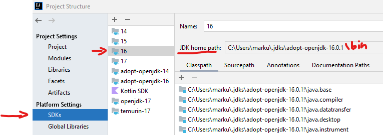
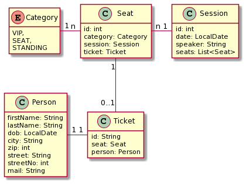

:icons: font
:toc: left

= How to use the backend server

== Ensure Java version

Open a terminal and execute `java --version` which should result in an output similar to this:

[source,bash]
----
openjdk 17.0.1 2021-10-19
OpenJDK Runtime Environment Temurin-17.0.1+12 (build 17.0.1+12)
OpenJDK 64-Bit Server VM Temurin-17.0.1+12 (build 17.0.1+12, mixed mode, sharing)
----

Check if you have _at least *16* as version_ in the path.
If *not* you can use the full path to the java 16 binary to execute the jar.

You can easily find the installation directory via the SDK view in IntelliJ like so:

== Run the backend

You have been provided with a file called `reservation-backend.jar`.
This contains the full, complete, backend -- you only have to execute it.

Use either (if you have a current enough Java in your path) +
`java -jar .\reservation-backend.jar` +
_or_ (if you have to use the full path) something like this +
`C:\full\path\to\my\adopt-openjdk-16.0.1\bin\java.exe -jar .\reservation-backend.jar`

You should then see the following output:

[source,bash]
----

            ___             __ _             _                               ___
    o O O  /   \   _ _     / _` |  _  _     | |    __ _      _ _     o O O  | __|   __ __   __ _    _ __
   o       | - |  | ' \    \__, | | +| |    | |   / _` |    | '_|   o       | _|    \ \ /  / _` |  | '  \
  TS__[O]  |_|_|  |_||_|   |___/   \_,_|   _|_|_  \__,_|   _|_|_   TS__[O]  |___|   /_\_\  \__,_|  |_|_|_|
 {======|_|"""""|_|"""""|_|"""""|_|"""""|_|"""""|_|"""""|_|"""""| {======|_|"""""|_|"""""|_|"""""|_|"""""|
./o--000'"`-0-0-'"`-0-0-'"`-0-0-'"`-0-0-'"`-0-0-'"`-0-0-'"`-0-0-'./o--000'"`-0-0-'"`-0-0-'"`-0-0-'"`-0-0-'

                                                                            Powered by Quarkus 2.6.1.Final
2022-01-23 08:57:48,952 INFO  [at.htl.InitBean] (main) ************************************************
2022-01-23 08:57:48,956 INFO  [at.htl.InitBean] (main) * swagger: http://localhost:8080/q/swagger-ui/ *
2022-01-23 08:57:48,956 INFO  [at.htl.InitBean] (main) ************************************************
2022-01-23 08:57:49,032 INFO  [io.quarkus] (main) reservation-backend 1.0-SNAPSHOT on JVM (powered by Quarkus 2.6.1.Final) started in 0.754s. Listening on: http://0.0.0.0:8080
2022-01-23 08:57:49,032 INFO  [io.quarkus] (main) Profile prod activated.
2022-01-23 08:57:49,033 INFO  [io.quarkus] (main) Installed features: [cdi, resteasy, resteasy-jackson, smallrye-context-propagation, smallrye-openapi, swagger-ui, vertx]
----

IMPORTANT: Keep the terminal window open!

== Check the API

Open http://localhost:8080/q/swagger-ui/ and get acquainted with the API.

This model might also help you understand how the application works:

== (Optional) Access the Code

The full code of the backend project is available to you. If you struggle to understand how to communicate with the API you are allowed to open the project, read the code, etc.